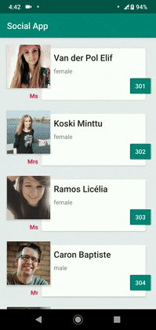

# LBG Baning Test App
Android App(online & Offline) using Clean Architecture, MVVM, DataBinding, Koin, Coroutines, LiveData, ViewModel, Room, Navigation, UnitTesting, MockTest and AndroidX. 
The data is fetched from <a href='https://randomuser.me/'>Random User</a>. 

  <i>*Data from <a href='https://randomuser.me/'>Random User</a></i> 

## Libraries and tools used in the project

## Author Name
Created by Siva kumar boddu

### Android & Android Jetpack Components

* [AndroidX](https://developer.android.com/jetpack/androidx)
Artifacts within the androidx namespace comprise the Android Jetpack libraries. Like the Support Library, 
libraries in the androidx namespace ship separately from the Android platform and provide backward compatibility 
across Android releases.
* [Data Binding](https://developer.android.com/topic/libraries/data-binding)
Write declarative layouts and minimize the glue code necessary to bind application logic and layouts.
* [Android KTX](https://github.com/android/android-ktx)
A set of Kotlin extensions for Android app development.
* [Navigation Component](https://developer.android.com/guide/navigation/navigation-getting-started)
Navigation refers to the interactions that allow users to navigate across, into, and back out from the different pieces of content within your app. Android Jetpack's Navigation component helps you implement navigation, from simple button clicks to more complex patterns, such as app bars and the navigation drawer. The Navigation component also ensures a consistent and predictable user experience by adhering to an established set of principles.
* [MVVM](https://en.wikipedia.org/wiki/Model%E2%80%93view%E2%80%93viewmodel)
  Model–view–viewmodel (MVVM) is an architectural pattern in computer software that facilitates the separation of the development of the graphical user interface (GUI; the view)—be it via a markup language or GUI code—from the development of the business logic or back-end logic (the model) such that the view is not dependent upon any specific model platform.
* [Swiperefreshlayout](https://developer.android.com/jetpack/androidx/releases/swiperefreshlayout)
  Android SwipeRefreshLayout is a ViewGroup that can hold only one scrollable child. It can be either a ScrollView, ListView or RecyclerView. The basic need for a SwipeRefreshLayout is to allow the users to refresh the screen manually. This is pretty common in the Facebook Newsfeed screen.
* [Google Material Design](https://developer.android.com/develop/ui/views/theming/look-and-feel#:~:text=Material%20design%20is%20a%20comprehensive,the%20material%20design%20support%20library.)
  Components are interactive building blocks for creating a user interface. They can be organized into five categories based on their purpose: Action, containment, navigation, selection, and text input..
* [TestCases](https://developer.android.com/training/testing/fundamentals)
  Test cases for android app.

###Open Source JSON API Call
* [JSON API Call](https://randomuser.me/api/?results=20)
  This is useful to Reads a JSON feed from the internet.
* 
### Architecture and Design

* [Android Architecture Components](https://developer.android.com/topic/libraries/architecture/index.html)
Android architecture components are a collection of libraries that help you design robust, testable, and maintainable apps. 
Start with classes for managing your UI component lifecycle and handling data persistence.
* [Koin](https://insert-koin.io/)
A pragmatic lightweight dependency injection framework for Kotlin developers. Written in pure Kotlin using functional 
resolution only: no proxy, no code generation, no reflection!
* [Coroutines](https://kotlinlang.org/docs/reference/coroutines-overview.html)
Asynchronous or non-blocking programming is the new reality. Whether we're creating server-side, desktop or mobile applications, 
it's important that we provide an experience that is not only fluid from the user's perspective, but scalable when needed.

### View and Image

* [ConstraintLayout](https://developer.android.com/training/constraint-layout/index.html)
Allows you to create large and complex layouts with a flat view hierarchy (no nested view groups).
* [RecyclerView](http://developer.android.com/reference/android/support/v7/widget/RecyclerView.html)
A flexible view for providing a limited window into a large data set.
* [Glide](https://github.com/bumptech/glide)
An image loading and caching library for Android focused on smooth scrolling

### Data Request

* [Retrofit](http://square.github.io/retrofit/)
A type-safe HTTP client for Android and Java.
* [OkHttp](http://square.github.io/okhttp/)
An HTTP & HTTP/2 client for Android and Java applications.

### Persistence

* [Room](https://developer.android.com/topic/libraries/architecture/room.html)
The Room persistence library provides an abstraction layer over SQLite to allow fluent database access while harnessing the full power of SQLite.

### Others technologies & methodologies which used:
* [Gradle Kotlin DSL](https://docs.gradle.org/current/userguide/kotlin_dsl.html)
Gradle’s Kotlin DSL provides an alternative syntax to the traditional Groovy DSL with an enhanced editing experience in supported IDEs, with superior content assist, 
refactoring, documentation, and more. This chapter provides details of the main Kotlin DSL constructs and how to use it to interact with the Gradle API.
* [LeakCanary](https://square.github.io/leakcanary/)
LeakCanary is a memory leak detection library for Android.
* [Timber](https://levelup.gitconnected.com/timber-a-logging-library-for-android-56c431cd7300)
  Timber — A Logging Library for Android.
